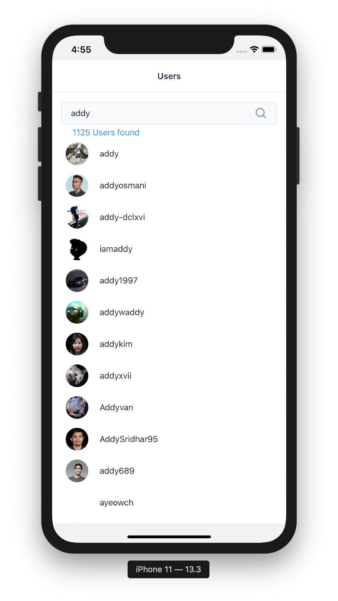
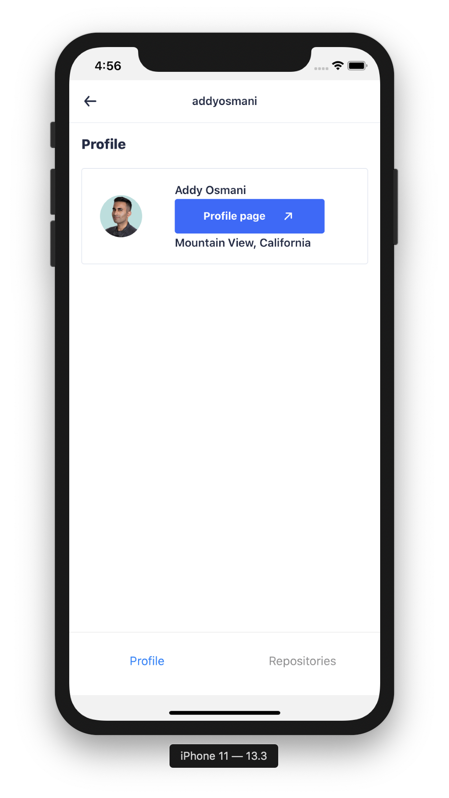
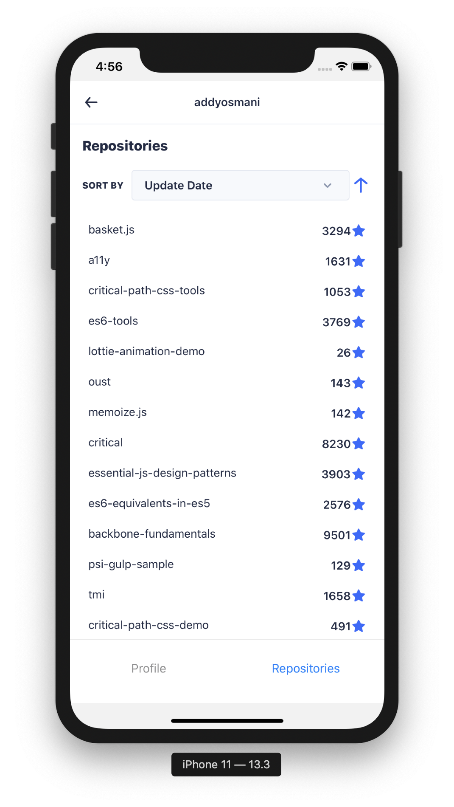

# GHUsers

<p align="center" margin-bottom="0">
    
    
        
</p>

## About The Project

This app let you search through GiHhub users and see user details including repos

### Built With

* [React Native](https://reactnative.dev/)
* [React Navigation](https://reactnavigation.org/)
* [Redux](https://redux.js.org/) 
* [Thunk](https://github.com/reduxjs/redux-thunk)
* [UI Kitten](https://akveo.github.io/react-native-ui-kitten/)
* [axios](https://github.com/axios/axios)
* [GitHub Api v3](https://developer.github.com/v3/)
* [parse-link-header](https://github.com/thlorenz/parse-link-header)


## Getting Started


### Prerequisites

* [yarn](https://yarnpkg.com/lang/en/docs/install/)
* [react-native requirements](https://reactnative.dev/docs/getting-started)

### Installation

##### Install project dependencies
```sh
yarn --frozen-lockfile
```


## Usage

##### iOS
```sh
npx react-native run-ios
```
##### Android
```sh
npx react-native run-android
```